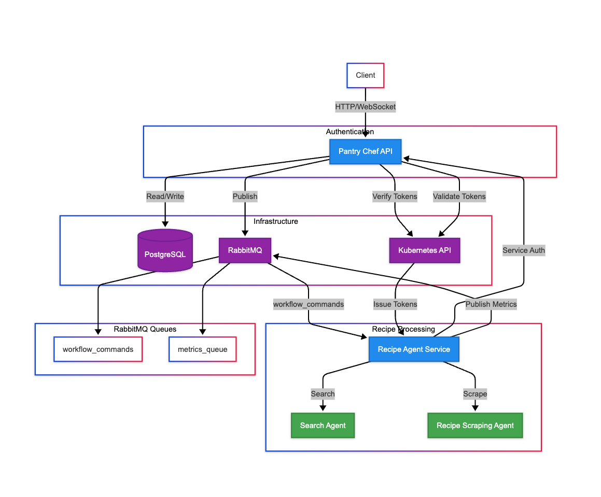
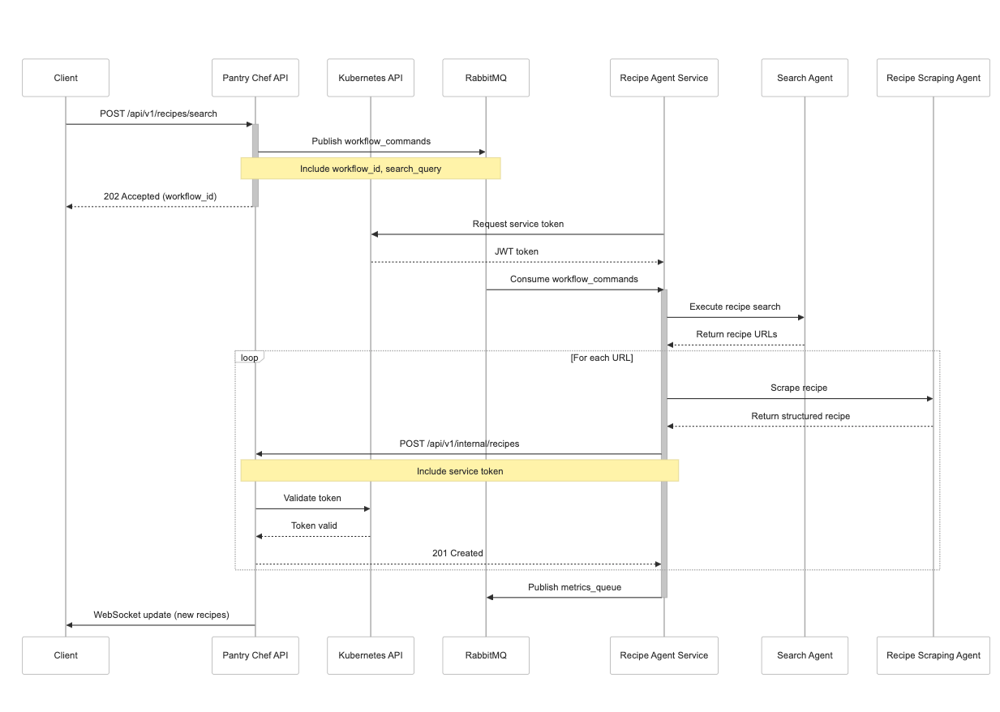

# Pantry Chef

## Overview
Pantry Chef is an intelligent recipe discovery and management platform that helps users find, save, and organize recipes from across the web. The platform uses AI-powered search and scraping capabilities to extract structured recipe data from various sources.

## Key Features
- Intelligent recipe search across multiple sources
- Automatic recipe extraction and structuring
- Real-time recipe updates via WebSocket
- Service-to-service authentication
- Metrics collection and monitoring

## Architecture

### Components

1. **Pantry Chef API**
   - Go-based REST API service
   - Handles user authentication and recipe management
   - Integrates with PostgreSQL for data persistence
   - Uses RabbitMQ for asynchronous recipe processing

2. **Recipe Agent Service**
   - Python-based microservice
   - Handles recipe search and extraction
   - Implements workflow orchestration
   - Communicates with API via service-to-service auth

3. **Infrastructure Components**
   - PostgreSQL: Primary data store
   - RabbitMQ: Message broker for async processing
   - Kubernetes: Container orchestration
   - Helm: Package management

### Component Diagram



### Sequence Diagram



## Development Setup

### Prerequisites
- Docker and Docker Compose
- Kubernetes cluster (local or cloud)
- Helm 3.x
- Go 1.21+
- Python 3.11+

### Quick Start

1. **Create Complete Deployment**
```bash
# Deploy everything
make create-pantry-chef

# Verify deployment
make verify-infra

# Get infrastructure credentials
make get-postgres-password
make get-redis-password
make get-rabbitmq-password

# Forward all necessary ports
make forward-all
```

2. **Delete Deployment**
```bash
# Remove everything
make delete-pantry-chef

# Optional: Complete cleanup
docker system prune -a
```

## Project Structure
```
pantry-chef/
├── api/                    # Go API service
├── services/
│   └── recipes/           # Recipe Agent Service
├── helm/                  # Helm charts
├── docs/                  # Documentation
└── scripts/               # Utility scripts
```

## Configuration

### Environment Variables
- `INFRA_NAMESPACE`: Kubernetes namespace for infrastructure (default: infrastructure)
- `CLUSTER_NAME`: Name of your Kubernetes cluster
- `DB_URL`: PostgreSQL connection string
- `RABBITMQ_URL`: RabbitMQ connection string

## Monitoring & Metrics

### Available Metrics
- Recipe search duration and success rates
- Recipe scraping performance and errors
- Workflow execution times
- API request latencies
- Queue processing statistics

### Monitoring Tools
- New Relic integration for service monitoring
- RabbitMQ management interface for queue monitoring
- Kubernetes dashboard for cluster monitoring

## Contributing

1. Fork the repository
2. Create your feature branch (`git checkout -b feature/amazing-feature`)
3. Commit your changes (`git commit -m 'Add some amazing feature'`)
4. Push to the branch (`git push origin feature/amazing-feature`)
5. Open a Pull Request


## Acknowledgments

- DuckDuckGo Search for recipe discovery
- Google Gemini for AI-assisted recipe scraping
- Open source community for various tools and libraries

## Support

For support, please open an issue in the GitHub repository or contact the maintainers.