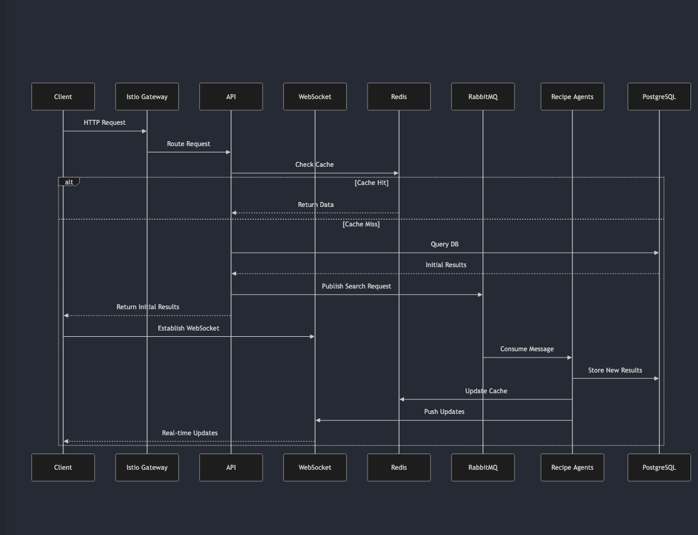

# Pantry Chef

## Architecture

### Component Diagram

### Flow Diagram

### Flow Description

1. **Synchronous Path**

   - Client requests come through Istio Ingress
   - API checks Redis cache first
   - If cache miss, queries PostgreSQL
   - Returns immediate results to client
   - Establishes WebSocket connection for updates

2. **Asynchronous Path**

   - API publishes search request to RabbitMQ
   - Recipe Engine agents consume messages
   - Agents process search asynchronously:
     - Search and analyze recipes
     - Store in PostgreSQL
     - Update Redis cache
     - Push updates through WebSocket

3. **Observability**
   - All components send telemetry to New Relic
   - Metrics, logs, and traces are collected
   - End-to-end request monitoring
