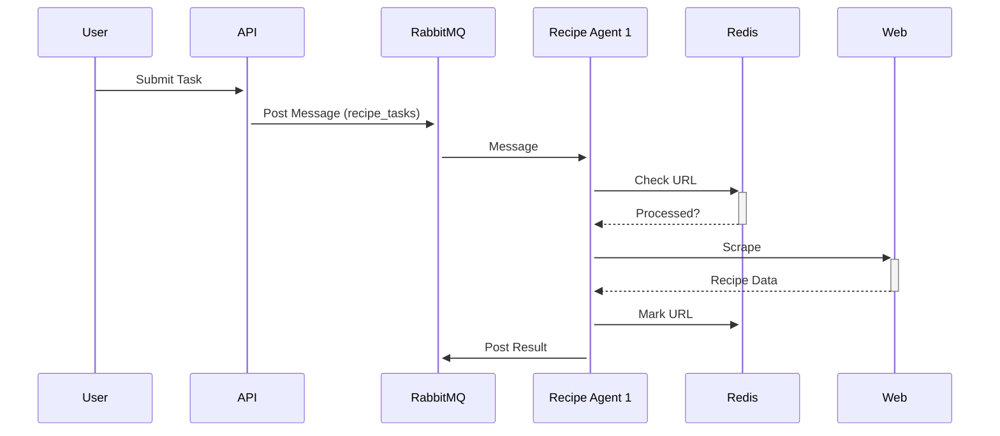

**1. Core Framework Components**

```python
# shared/framework/base.py
from pydantic import BaseModel
from abc import ABC, abstractmethod
from typing import Any, Dict

class AgentMessage(BaseModel):
    task_id: str
    payload: Dict[str, Any]
    metadata: Dict[str, str] = {}

class BaseAgent(ABC):
    @abstractmethod
    async def process_message(self, msg: AgentMessage) -> Dict:
        """Process incoming message from queue"""
        
    @classmethod
    @abstractmethod
    def queue_name(cls) -> str:
        """RabbitMQ queue name to listen to"""
```

**2. Redis Context Service (using your standalone setup)**

```python
# shared/framework/context.py
import redis
from tenacity import retry, wait_fixed

class RedisContext:
    def __init__(self):
        self.conn = redis.Redis(
            host=os.getenv("REDIS_HOST"),
            password=os.getenv("REDIS_PASSWORD"),
            decode_responses=True
        )
    
    @retry(wait=wait_fixed(1))
    def mark_processed(self, key: str):
        self.conn.setex(key, 86400, "1")  # 24h TTL

    def is_processed(self, key: str) -> bool:
        return bool(self.conn.exists(key))
```

**3. Recipe Agent Service Implementation**

```python
# services/recipes/src/agent_service.py
from shared.framework.base import BaseAgent, AgentMessage
from shared.framework.context import RedisContext

class RecipeAgentService(BaseAgent):
    def __init__(self):
        self.redis = RedisContext()
        self.agent = RecipeAgent()  # Your existing RecipeAgent
        
    @classmethod
    def queue_name(cls) -> str:
        return "recipe_tasks"

    async def process_message(self, msg: AgentMessage):
        # Check if URL already processed
        if self.redis.is_processed(msg.payload["url"]):
            return {"status": "skipped", "task_id": msg.task_id}
            
        try:
            result = self.agent.run(msg.payload["query"])
            self.redis.mark_processed(msg.payload["url"])
            return {"status": "success", **result}
        except Exception as e:
            return {"status": "error", "error": str(e)}
```

**4. RabbitMQ Listener Service (Shared)**

```python
# shared/mq/listener.py
import aio_pika
from contextlib import asynccontextmanager

class MQListener:
    def __init__(self, agent: BaseAgent):
        self.agent = agent
        
    async def start(self):
        connection = await aio_pika.connect_robust(
            host=os.getenv("RABBITMQ_HOST"),
            login=os.getenv("RABBITMQ_USER"),
            password=os.getenv("RABBITMQ_PASS")
        )
        
        async with connection:
            channel = await connection.channel()
            queue = await channel.declare_queue(self.agent.queue_name())
            
            async for message in queue:
                async with message.process():
                    msg_data = AgentMessage.parse_raw(message.body)
                    result = await self.agent.process_message(msg_data)
                    # Send result to results exchange
                    await channel.default_exchange.publish(
                        aio_pika.Message(
                            body=json.dumps(result).encode()
                        ),
                        routing_key=f"results.{msg_data.task_id}"
                    )
```

**5. Deployment Configuration**

```yaml
# helm/values/rabbitmq-values.yaml
auth:
  username: admin
  password: strongpassword
  erlangCookie: secretcookie

persistence:
  enabled: true
  storageClass: "local-path"
  size: 5Gi

resources:
  limits:
    memory: 512Mi
    cpu: 500m
```

**6. Agent Service Dockerfile Additions**

```dockerfile
# Add to existing Dockerfile
ENV RABBITMQ_HOST="rabbitmq"
ENV REDIS_HOST="redis"
ENV AGENT_TYPE="recipe"  # Override in child deployments

# Health checks
HEALTHCHECK --interval=30s --timeout=3s \
  CMD python -c "import socket; s = socket.socket(); s.connect(('${RABBITMQ_HOST}', 5672))"
```

**Implementation Plan**

1. **Phase 1 - Base Framework**
   - Add shared framework classes to `shared/framework`
   - Deploy Redis and RabbitMQ using Helm charts
   - Add message listener bootstrap code

2. **Phase 2 - Recipe Agent Adaptation**
   - Wrap existing RecipeAgent in new service class
   - Add Redis URL tracking to scraping logic
   - Modify search workflow to check Redis first

3. **Phase 3 - Deployment Setup**
   - Create Helm chart for agent services
   - Configure Kubernetes probes and scaling
   - Set up CI/CD pipeline for agent updates

4. **Phase 4 - New Agent Types**
   - Create `NewsAgent` following same pattern
   - Add news-specific output model
   - Deploy as separate pod with own queue

**Key Agent Service Requirements**

1. Each agent must:
   - Declare its RabbitMQ queue name
   - Implement message processing interface
   - Handle its own context tracking
   - Report results to central exchange

2. Shared infrastructure:
   - Redis for cross-agent context
   - RabbitMQ for task distribution
   - Unified logging format
   - Standard health checks

**Execution Flow**



This plan maintains your existing RecipeAgent logic while adding the distributed coordination layer. Each service remains independently deployable while sharing core infrastructure.
