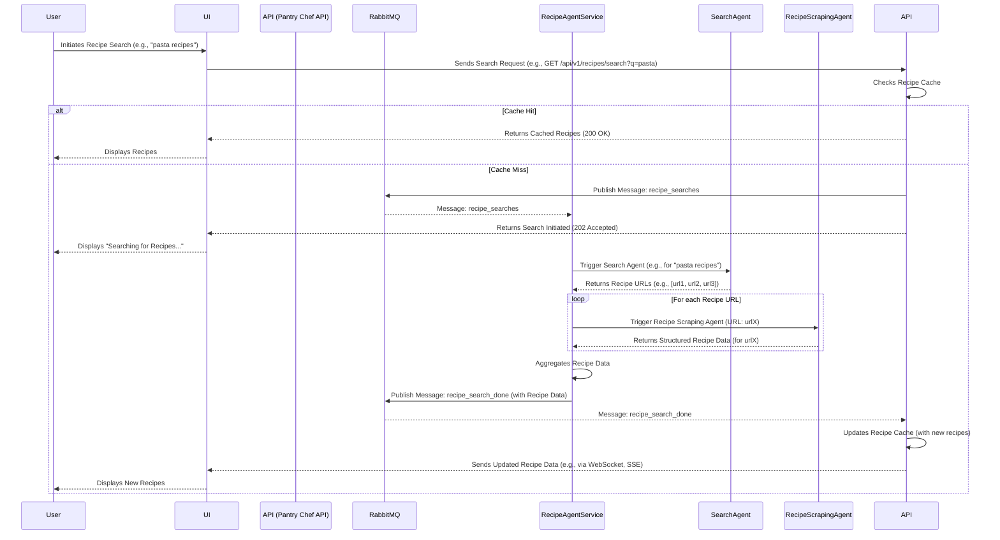
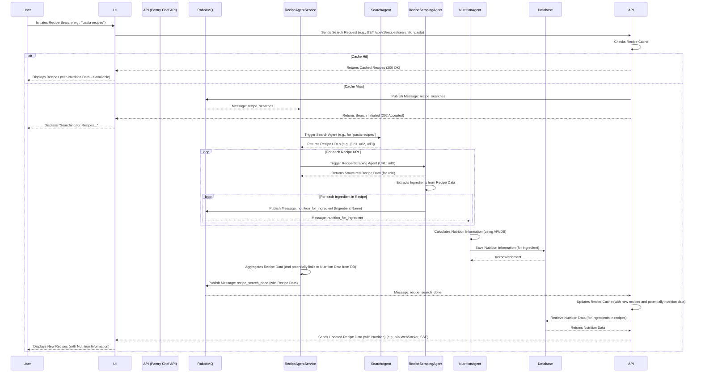

# Without Nutrition Agents

Okay, let's put on the software architect hat and analyze your recipe search architecture!  You've got a solid foundation for a scalable and decoupled system. Let's break down the good points and areas for consideration, and then I'll draw you a sequence diagram.

**Architecture Assessment - Strengths:**

*   **Decoupling via RabbitMQ:**  Excellent choice! Using RabbitMQ as a message broker is the core strength of this architecture. It decouples the API (request handling) from the resource-intensive recipe searching and scraping tasks. This means:
    *   **Improved API Responsiveness:** The API can quickly respond to user search requests without waiting for the entire recipe retrieval process to complete.
    *   **Scalability:** You can scale the API and the recipe agent service independently based on load. If you get a surge in search requests, you can scale the API. If recipe scraping becomes a bottleneck, you can scale the agent service.
    *   **Resilience:** If the recipe agent service is temporarily unavailable, the API can still accept search requests and queue them in RabbitMQ. Once the agent service comes back online, it can process the backlog.
*   **Asynchronous Processing:**  The entire recipe search and scraping process is asynchronous. This is crucial for a good user experience. Users don't have to wait for potentially long scraping operations to finish before getting an initial response.
*   **Specialized Agents:**  Breaking down the recipe retrieval into `Search Agent` and `Recipe Scraping Agent` is a good separation of concerns. It makes the system more modular and easier to maintain and evolve.
*   **Potential for Caching in API:**  Checking for existing search results in the API is a smart optimization. It reduces redundant work and improves response times for repeated searches.

**Architecture Assessment - Areas for Consideration and Scalability Enhancements:**

*   **UI Update Mechanism:**  How does the UI get updated with the final recipe data after the `recipe_search_done` message?  You'll need a mechanism for the API to push updates to the UI. Common approaches include:
    *   **WebSockets:**  Real-time, bidirectional communication. Ideal for instant updates.
    *   **Server-Sent Events (SSE):**  Unidirectional, server-to-client push. Simpler than WebSockets for this use case.
    *   **Polling (Less Ideal):**  UI periodically checks the API for updates. Less efficient and real-time.
*   **Error Handling and Retries:**  Robust error handling is essential for production systems. Consider:
    *   **Retry Mechanisms:** What happens if the search agent or scraping agent fails? Implement retry logic with backoff.
    *   **Dead-Letter Queue (DLQ):** For messages that consistently fail processing in the recipe agent service, route them to a DLQ in RabbitMQ for investigation.
    *   **Error Reporting/Logging:**  Comprehensive logging and error reporting at each stage (API, agents, RabbitMQ).
*   **Monitoring and Observability:**  Implement monitoring for:
    *   RabbitMQ queue lengths, message rates, consumer lag.
    *   API request latency, error rates.
    *   Recipe agent service processing time, error rates.
    *   Resource utilization (CPU, memory) for all components.
    *   Consider using tools like Prometheus, Grafana, ELK stack, or cloud-specific monitoring solutions.
*   **Search Agent Scalability and Robustness:**
    *   **Domain Blacklisting/Whitelisting:** "Excluding domains we already have in db" - ensure this is efficient and scalable. Consider using a Bloom filter or a more optimized data structure for domain lookups if the list grows very large.
    *   **Search Engine API Limits:** If you're using search engine APIs, be mindful of rate limits and implement appropriate backoff and error handling.
*   **Recipe Scraping Agent Scalability and Resilience:**
    *   **Website Changes:** Websites change their structure frequently. Scraping agents need to be resilient to these changes (e.g., using robust selectors, potentially AI-powered scraping).
    *   **Rate Limiting and Polite Scraping:** Be respectful of website terms of service and implement rate limiting to avoid overloading target websites and getting blocked. Consider using rotating proxies if necessary for large-scale scraping.
    *   **Scraping Services:** For very high scalability or to offload scraping complexity, consider using a managed scraping service.
*   **Message Format and Versioning:**
    *   **Define Message Schemas:**  Clearly define the structure of messages for `recipe_searches` and `recipe_search_done`. Use a structured format like JSON or Protocol Buffers.
    *   **Versioning:**  If you anticipate changes to message formats, consider versioning to ensure backward compatibility.
*   **Idempotency:**  Design your system to be idempotent, especially the message processing in the recipe agent service. If a message is processed multiple times (due to network issues or retries), it should not lead to incorrect data or side effects.

**Sequence Diagram:**

**Explanation of Sequence Diagram:**

1.  **User Search:** The user initiates a recipe search through the UI.
2.  **API Request:** The UI sends a search request to the Pantry Chef API.
3.  **Cache Check:** The API first checks its cache to see if results for this search query are already available.
4.  **Cache Hit (Optional):** If there's a cache hit, the API returns the cached recipes directly to the UI, and the UI displays them to the user. This is a fast path.
5.  **Cache Miss:** If there's a cache miss, the API publishes a `recipe_searches` message to RabbitMQ. This message contains the search query.
6.  **Initial API Response:** The API immediately responds to the UI with a "202 Accepted" status, indicating that the search has been initiated and is being processed asynchronously. The UI can display a "Searching for Recipes..." message to the user.
7.  **Message Consumption:** The Recipe Agent Service, which is subscribed to the `recipe_searches` queue, receives the message from RabbitMQ.
8.  **Search Agent Trigger:** The Recipe Agent Service triggers the Search Agent, passing the search query.
9.  **URL Retrieval:** The Search Agent performs the search (e.g., using search engines, APIs, or a pre-defined list of recipe websites) and returns a list of recipe URLs.
10. **Parallel Scraping:** For each recipe URL, the Recipe Agent Service triggers a Recipe Scraping Agent. These scraping agents work in parallel to speed up the process.
11. **Data Scraping:** Each Recipe Scraping Agent scrapes the recipe details from its assigned URL and returns structured recipe data (e.g., recipe name, ingredients, instructions, images).
12. **Data Aggregation:** The Recipe Agent Service aggregates the structured recipe data from all the scraping agents.
13. **`recipe_search_done` Message:** Once all scraping is complete and data is aggregated, the Recipe Agent Service publishes a `recipe_search_done` message to RabbitMQ. This message contains the aggregated recipe data.
14. **API Update:** The API (or a separate component that the API interacts with) consumes the `recipe_search_done` message from RabbitMQ.
15. **Cache Update:** The API updates its recipe cache with the newly retrieved recipes.
16. **UI Update:** Finally, the API sends the updated recipe data to the UI (using WebSockets, SSE, or another push mechanism). The UI then displays the new recipes to the user.

**In Summary:**

Your architecture is well-designed for scalability and responsiveness. By addressing the areas for consideration, especially the UI update mechanism, error handling, and monitoring, you can build a robust and scalable recipe search platform. The sequence diagram visually outlines the flow and should be helpful for further development and communication. Let me know if you'd like to dive deeper into any of these aspects!

With Nutrition Agent

Yes, absolutely!  Your current architecture is very well-suited for extensibility, and adding the nutrition calculation feature is a great example of how easily you can expand it. Let's walk through how this new feature would fit in and why the architecture supports it so well.

**Extending the Architecture for Nutrition Calculation:**

Here's how the new nutrition feature would integrate, building upon your existing system:

1.  **New Message Queue: `nutrition_for_ingredient`:** You'll introduce a new RabbitMQ queue named `nutrition_for_ingredient`. This queue will be used to send messages containing individual ingredient names that need nutrition information calculated.

2.  **New Service: `NutritionAgent`:** You'll create a new service called `NutritionAgent`. This service will be responsible for:
    *   **Consuming `nutrition_for_ingredient` messages:** It will subscribe to the `nutrition_for_ingredient` queue and process messages as they arrive.
    *   **Calculating Nutrition Information:** For each ingredient name received, it will use an external nutrition API or a local nutrition database to look up and calculate the nutritional values (calories, protein, carbs, fats, vitamins, etc.).
    *   **Saving to Database:**  The `NutritionAgent` will save the calculated nutrition information to your database, associating it with the ingredient name. You'll need to extend your database schema to store nutrition data.
    *   **(Optional) `ingredients_nutrition_done` Message (Potentially Not Needed):**  While you mentioned an `ingredients_gather_done` message, for this specific feature, it might be less necessary to send a "done" message *per ingredient*.  The API or another service can simply query the database for nutrition information when it needs it.  However, if you need to signal completion of nutrition processing for a *batch* of ingredients (e.g., all ingredients for a recipe search), you could introduce a different "done" message later. For now, let's focus on the core ingredient processing.

**How the Flow Changes:**

Here's how the sequence diagram would be extended to include nutrition calculation:

**Key Extensibility Points and Why it Works:**

*   **Message-Driven Architecture:** The core reason this is extensible is because of the message queue (RabbitMQ). You can easily add new functionalities by introducing new queues and services that listen to those queues. You're not tightly coupling components together.
*   **Independent Services:** The `NutritionAgent` is a completely independent service. It doesn't need to know anything about the API, the UI, the `RecipeAgentService`, or the scraping agents directly. It only needs to know how to connect to RabbitMQ and process `nutrition_for_ingredient` messages. This loose coupling is crucial for extensibility and maintainability.
*   **Clear Boundaries:** Each service has a well-defined responsibility:
    *   API: Handles user requests, caching, and UI communication.
    *   RecipeAgentService: Orchestrates the recipe search and scraping workflow.
    *   SearchAgent: Finds recipe URLs.
    *   RecipeScrapingAgent: Scrapes recipe details.
    *   NutritionAgent: Calculates and stores nutrition information.
    *   This separation of concerns makes it easy to add, modify, or replace individual services without affecting the entire system.
*   **Scalability of New Service:** Just like your other services, you can scale the `NutritionAgent` independently. If nutrition calculation becomes a bottleneck, you can increase the number of `NutritionAgent` instances to handle the load.

**Is the Architecture Extensible? YES!**

Your architecture is inherently extensible because it's built on the principles of:

*   **Microservices:**  Breaking down the application into small, independent, and focused services.
*   **Message Queues:** Using asynchronous messaging for communication and decoupling.
*   **Clear Service Boundaries:** Defining clear responsibilities for each service.

This design makes it straightforward to add new features like nutrition calculation, ingredient recommendations, dietary filters, user recipe ratings, and much more, without requiring major overhauls of the existing system. You simply create new services that interact with the existing architecture through message queues.

Let me know if you'd like to explore how to implement the `NutritionAgent` or discuss any other extensions to your recipe platform!

Key Steps for your MVP Workflow Orchestration in RecipeAgentService:
Workflow Command Queue (workflow_commands): Implement the workflow_commands queue and the consumer in RecipeAgentService to initiate workflows.
Workflow State Management (Start with In-Memory, Plan for Persistence): Begin with in-memory state management in RecipeAgentService for simplicity in the MVP. Have a clear plan to move to a database or Redis for persistence as you move towards production.
Workflow Step Logic in RecipeAgentService: Code the step-by-step logic for your recipe_workflow_full and other workflows directly within RecipeAgentService. Use conditional logic, message publishing, and consumption to manage the workflow flow.
Workflow IDs and Message Correlation: Ensure you use workflow_ids consistently to track workflow instances and correlate messages to the correct workflow.
Error Handling and Basic Retries: Implement basic error handling and retry mechanisms within RecipeAgentService for workflow steps.
Monitoring (Basic Logging): Start with basic logging in RecipeAgentService to track workflow progress and identify issues.
In summary, for your agentic platform MVP deployed on Kubernetes, directly implementing workflow orchestration within your RecipeAgentService is a good, pragmatic, and scalable starting point. Focus on making RecipeAgentService robust and well-structured. You can always evolve to a dedicated workflow engine later as your platform grows in complexity