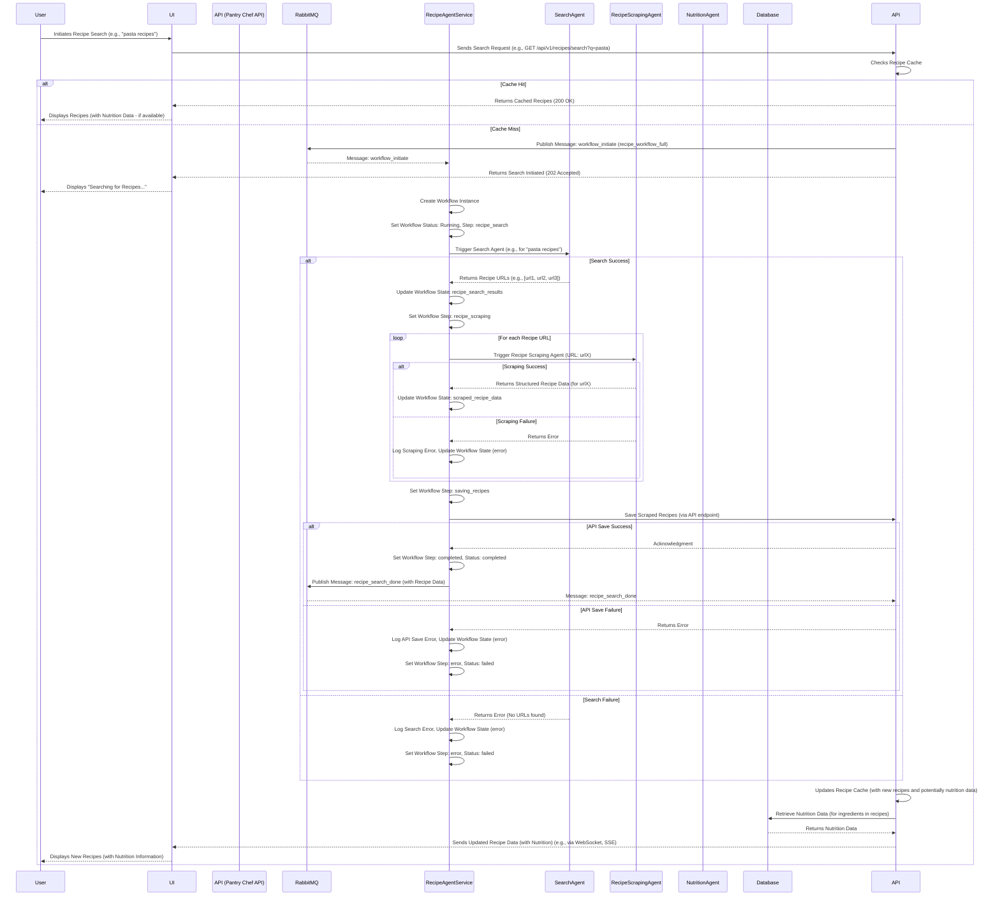

Okay, let's revisit the sequence diagram and the MVP scope in `sequence-diagrams.md` with your points about handling millions of recipes and disaster recovery in mind.

**Review of `sequence-diagrams.md` for MVP Completeness:**

Looking at the current sequence diagram and the MVP user stories, we've covered the core **happy path** for the `recipe_workflow_full`:

*   **User Search Initiation:** User triggers a search in the UI.
*   **API Handling:** API receives the request, checks cache, and initiates the workflow if needed.
*   **Asynchronous Workflow Orchestration:** `RecipeAgentService` orchestrates the `recipe_search` and `recipe_scraping` steps.
*   **Data Retrieval and Aggregation:** Search and Scraping Agents retrieve recipe data.
*   **Data Persistence (Implicit):**  The diagram shows `RecipeAgentService` publishing `recipe_search_done`, which implies the API will then save the recipes (though saving to the database isn't explicitly shown in the diagram itself, it's part of the user stories).
*   **UI Update:**  API updates the UI with new recipes.

**What's Missing or Implicit for MVP (and beyond):**

1.  **Error Handling and Failure Paths:** The current diagram primarily shows the successful flow.  For a robust MVP (and certainly for production), we need to consider error scenarios at each step:
    *   **Search Agent Fails:** What if the search agent can't find URLs?
    *   **Scraping Agent Fails:** What if scraping a URL fails (website down, changed structure, timeouts)?
    *   **API Save Fails:** What if saving to the Recipe API fails (network issues, API errors)?
    *   **Message Queue Issues:**  What if there are problems with RabbitMQ?

    *For MVP, we should at least have basic error logging and handle failures gracefully, preventing the entire workflow from crashing.  More sophisticated retry mechanisms and dead-letter queues can be considered for post-MVP.*

2.  **Scalability Considerations (Implicit, but not Explicitly Diagrammed):** While the architecture *is* designed for scalability, the diagram doesn't explicitly show scalability mechanisms.  For MVP, we might not need *massive* scaling, but we should keep it in mind:
    *   **Horizontal Scaling of Services:**  The diagram implies that services like `RecipeAgentService`, `SearchAgent`, `RecipeScrapingAgent`, and `NutritionAgent` can be scaled horizontally (multiple instances).  This is good, but not visually represented.
    *   **RabbitMQ as a Scalable Broker:**  RabbitMQ is a scalable message broker, but the diagram doesn't highlight this aspect.

3.  **Monitoring and Observability (Implicit):**  Monitoring is crucial, but not shown in the sequence diagram.  For MVP, basic logging is planned, but for a more complete picture, we'd want to monitor:
    *   RabbitMQ queue lengths.
    *   Service health and performance.
    *   Workflow success/failure rates.

4.  **Database Interaction Details (Simplified):** The diagram simplifies database interactions.  For MVP, we need to ensure:
    *   Efficient database schema for recipes, ingredients, and potentially nutrition data.
    *   API interactions with the database are optimized.

5.  **Disaster Recovery and Backup (Not in MVP Scope, but Plan for Future):**  As you mentioned, DR/backup is essential for production but likely *out of scope* for the initial MVP sprint.  However, we should acknowledge it as a critical future requirement.

**Updated Sequence Diagram (Adding Error Handling and Nutrition Agent - Conceptual):**

To make the diagram more comprehensive, let's conceptually add error handling and the Nutrition Agent (even if Nutrition Agent is post-MVP, it shows extensibility).  We'll simplify error handling representation in the diagram for clarity.

**Key Updates in the Diagram:**

*   **`workflow_initiate` Message:**  Using `workflow_initiate` message to start the workflow, aligning with our sprint plan.
*   **Workflow Instance Creation and State:** Explicitly showing workflow instance creation and state updates within `RecipeAgentService`.
*   **Error Handling (Simplified):**  Added `alt/else` blocks to represent success and failure paths for Search, Scraping, and API Save steps.  Error logging and workflow state updates on failure are indicated.
*   **Nutrition Agent (Conceptual):**  Nutrition Agent and related messages are still in the diagram (as in the previous version) to show the planned extensibility, even if it's not in the MVP sprint.

**MVP Scope - Re-confirmed and Realistic:**

For the **MVP Sprint 1**, focusing on the **happy path** of `recipe_search` and basic workflow orchestration is a realistic and achievable goal.  We should aim to implement:

*   Workflow initiation via `workflow_commands` queue.
*   Basic `recipe_search` step (even with hardcoded sites).
*   In-memory workflow state management.
*   Basic logging.
*   End-to-end testing of workflow initiation and `recipe_search` step.

**Post-MVP Sprints (for Scalability, Robustness, and DR):**

*   **Sprint 2 (Example):** Implement `recipe_scraping` step, Recipe API integration, `recipe_search_done` message publishing, basic error handling and logging improvements.
*   **Sprint 3 (Example):** Implement more robust error handling (retries, DLQ), improve `search_recipes` and `scrape_recipe_data` functions, basic monitoring setup.
*   **Sprint 4 (Example - "Last Sprint" for Core Recipe Workflow):** Focus on scalability optimizations, performance testing, database optimizations, *plan for* disaster recovery and backup strategy (implementation might be in a later "Ops/Infrastructure" sprint).  *Nutrition Agent could also be considered for Sprint 4 or a subsequent sprint.*
*   **Separate "Ops/Infrastructure" Sprint:**  Dedicated sprint for implementing disaster recovery, backups, more comprehensive monitoring, security hardening, and infrastructure scaling.

**Millions of Recipes and Disaster Recovery - Future Sprints:**

*   Handling millions of recipes will require:
    *   Database optimizations and scaling.
    *   Caching strategies at multiple levels (API, potentially in agents).
    *   Efficient search and indexing mechanisms.
    *   Load testing and performance tuning.
    *   Horizontal scaling of all services.
*   Disaster recovery and backup will require:
    *   Database backups and restore procedures.
    *   Replication and redundancy for critical components (RabbitMQ, Redis, potentially RecipeAgentService state if persisted).
    *   Disaster recovery plan and testing.
